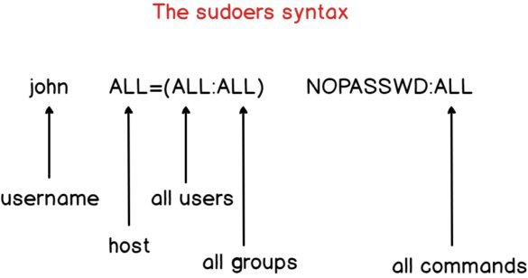

<h1 align="center">ArchLinux 64 bit</h1>

1. https://wiki.archlinux.org/index.php/Installation_guide
2. https://wiki.archlinux.org/index.php/General_recommendations

## [Autostart](https://wiki.archlinux.org/index.php/Autostarting)

archloginshell
	-> login
		-> bash_profile 
			-> startx

startx 
	-> initrc (/etc/X11/xinit)
		-> 10-monitor.conf
		-> pcmanfm -d & qtile

## Date, Time, System Clock
```
$ timedatectl
    > status
    > list-timezones
    > set-timezone <name>
    > set-ntp true
$ sudo hwclock --show
```

## Useful

- [Manage screens](https://github.com/Jakkins/Linux/blob/master/Arch%20Linux/x86_64/Manage%20Screens.md)
- [Where PATH is setted?](https://stackoverflow.com/questions/37676849/where-is-path-variable-set-in-ubuntu)
- fn+f1
- [NTFS on Arch](https://wiki.archlinux.org/index.php/NTFS-3G)
- libmtp = MTP = Media Transfer Protocol (From Arch to Android)
- [Difference between .Xresources and .Xdefaults?](https://superuser.com/questions/243914/what-is-the-difference-between-xresources-and-xdefaults)
	```
	./.Xdefaults is the older method of storing ./.Xresources
	```

## Pacman

```bash
pacman -Syu
pacman -Ql packagename
```

## Sudo



## Bho, Idk maybe will be useful

```
/usr/lib/gtk-3.0/modules/libcanberra-gtk-module.so
/usr/lib/gnome-settings-daemon-3.0/gtk-modules/canberra-gtk-module.desktop
/usr/lib/gtk-2.0/modules/libcanberra-gtk-module.so
/etc/X11/xinit/xinitrc.d/40-libcanberra-gtk-module.sh
```